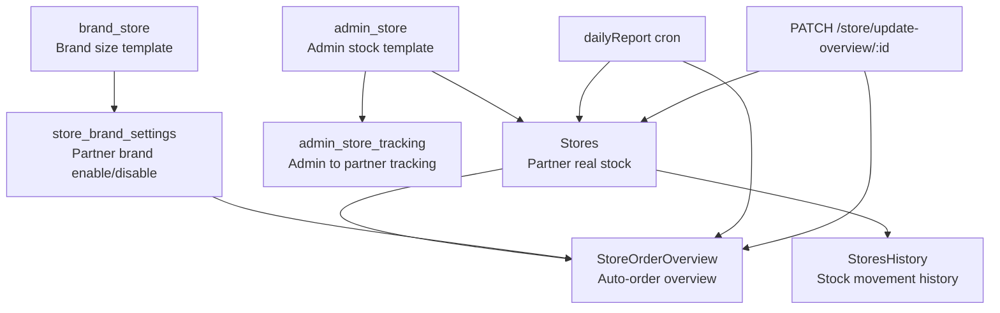
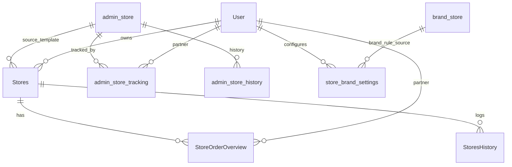
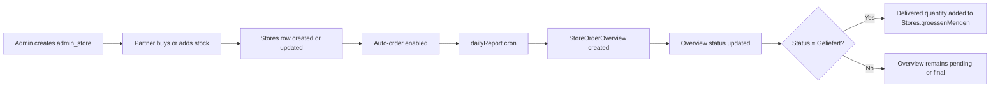
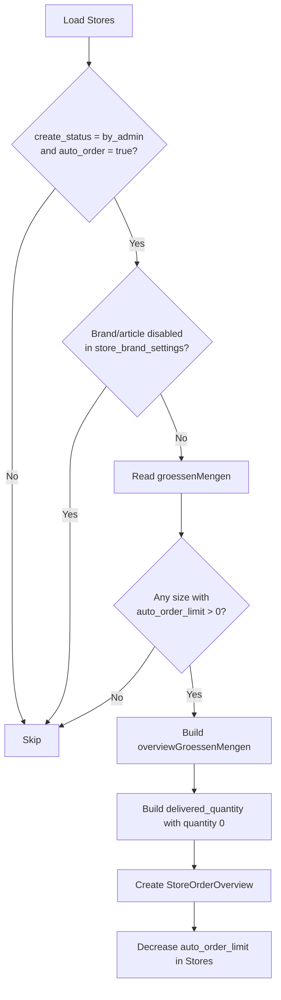
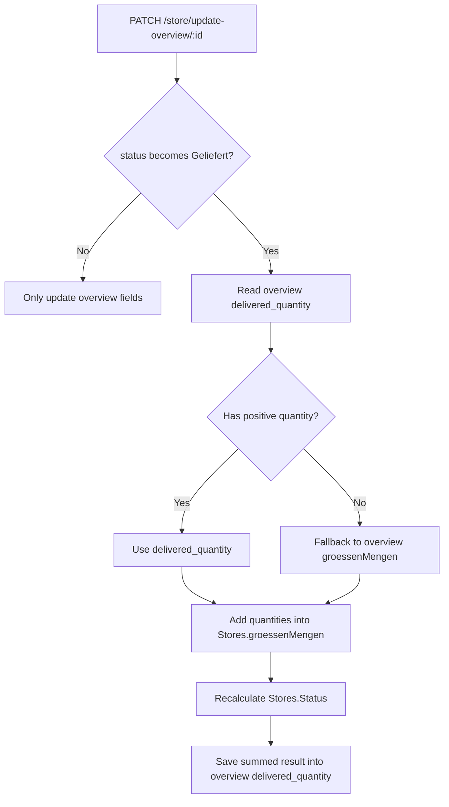

# Stock Module Documentation

## Scope

This document explains the full stock system under `module/v1/storage/` and the related Prisma models in `prisma/schema.prisma`, plus the stock overview cron in `cron/weekly_report.ts`.

This stock system is split into 3 API areas:

- `v1/store/*`
- `v1/store/admin-store/*`
- `v1/store/settings/*`

It also depends on these Prisma models:

- `admin_store`
- `brand_store`
- `admin_store_tracking`
- `admin_store_history`
- `Stores`
- `StoreOrderOverview`
- `StoresHistory`
- `store_brand_settings`

And this cron job:

- `dailyReport()` in `cron/weekly_report.ts`

## Folder Map

Files inside this folder:

- `storage.routes.ts`: main partner/admin store routes
- `storage.controllers.ts`: store CRUD, overview handling, analytics, history
- `admin_store/admin_store.routes.ts`: admin template stock routes
- `admin_store/admin_store.controllers.ts`: admin template stock + brand store management
- `settings/settings.routes.ts`: stock settings routes
- `settings/settings.controllers.ts`: brand toggle + auto-order toggle

## Public Route Prefixes

From `module/v1/index.ts`, these route prefixes are mounted:

- `/store`
- `/store/admin-store`
- `/store/settings`

So example full URLs are:

- `GET /store/my/get`
- `POST /store/buy`
- `GET /store/admin-store/get-all`
- `POST /store/settings/toggle-brand`

## Diagram Overview

### Stock System Map



### Prisma Relation View



### Main Lifecycle Flow



### Auto-Order Cron Flow



### Overview Delivery Flow



## Core Concepts

### 1. `admin_store`

`admin_store` is the source catalog/template stock created by admin. Partners can buy or add stock from it.

Important fields:

- `image`
- `price`
- `brand`
- `productName`
- `artikelnummer`
- `eigenschaften`
- `groessenMengen`
- `type`
- `features`

Main idea:

- admin creates a reusable stock template
- partner buys from this template
- buying creates a real `Stores` row for the partner

### 2. `brand_store`

`brand_store` stores one brand-level size template per brand and per `StoreType`.

Important fields:

- `brand`
- `groessenMengen`
- `type`

Main idea:

- used as reusable brand-level size metadata
- also used by settings APIs for enabling/disabling brands per partner

### 3. `Stores`

`Stores` is the real inventory row owned by a partner.

Important fields:

- `produktname`
- `hersteller`
- `artikelnummer`
- `lagerort`
- `mindestbestand`
- `image`
- `groessenMengen`
- `purchase_price`
- `selling_price`
- `Status`
- `features`
- `create_status`
- `type`
- `userId`
- `adminStoreId`
- `auto_order`

Main idea:

- this is the actual current stock state
- one store row represents one partner-owned stock item
- `groessenMengen` is the live inventory state
- `Status` is the calculated stock status

### 4. `admin_store_tracking`

`admin_store_tracking` records stock that came from admin-side supply flows.

Important fields:

- `storeId`
- `partnerId`
- `produktname`
- `hersteller`
- `artikelnummer`
- `lagerort`
- `groessenMengen`
- `price`
- `image`
- `type`
- `features`
- `parcessAt`
- `admin_storeId`

Main idea:

- audit/log of stock supplied from admin inventory
- supports admin tracking screens and price summaries

### 5. `StoreOrderOverview`

`StoreOrderOverview` is an auto-order or stock overview row linked to a store.

Important fields:

- `storeId`
- `partnerId`
- `artikelnummer`
- `produktname`
- `hersteller`
- `groessenMengen`
- `delivered_quantity`
- `status`
- `type`

Main idea:

- created automatically by cron from store auto-order rules
- represents stock requested or prepared for delivery
- later updated through overview APIs

### 6. `StoresHistory`

`StoresHistory` is the detailed stock movement log.

Important fields:

- `storeId`
- `changeType`
- `quantity`
- `newStock`
- `reason`
- `text`
- `partnerId`
- `customerId`
- `orderId`
- `status`

Main idea:

- history/audit trail for stock changes
- used for stock history API and performer analytics

### 7. `store_brand_settings`

`store_brand_settings` stores whether a brand is active or disabled for a partner.

Important fields:

- `partnerId`
- `brand`
- `type`
- `isActive`

Main idea:

- if a brand is inactive, auto-order related behavior can be blocked for matching store brands/article numbers

## Important Enums

### `StoreType`

- `rady_insole`
- `milling_block`

### `CreateStatus`

- `by_self`
- `by_admin`

### `StoreOrderOverviewStatus`

- `In_bearbeitung`
- `Versendet`
- `Geliefert`
- `Storniert`
- `cancelled`

### `StoresHistoryStatus`

- `SELL_OUT`
- `STOCK_UPDATE`

### `ChangeType`

- `sales`
- `createStock`
- `updateStock`

## `groessenMengen` Shape

This stock system uses JSON for size-based quantities.

### `rady_insole`

Typical shape:

```json
{
  "35": {
    "length": 87,
    "quantity": 27,
    "mindestmenge": 70,
    "auto_order_limit": 92,
    "auto_order_quantity": 88
  }
}
```

### `milling_block`

Typical shape:

```json
{
  "1": {
    "length": 0,
    "quantity": 27,
    "mindestmenge": 70,
    "auto_order_limit": 92,
    "auto_order_quantity": 88
  }
}
```

Notes:

- API responses may add `warningStatus`
- controllers try not to persist `warningStatus` into the database
- `quantity` is the real stock quantity
- `mindestmenge` is the per-size threshold
- `auto_order_limit` is the remaining number of automatic reorder cycles
- `auto_order_quantity` is how much cron should request into an overview

## Main Data Flow

### Flow 1: Admin template stock

1. Admin creates `admin_store`.
2. Admin can update or delete it.
3. The brand can also be reflected in `brand_store`.

### Flow 2: Partner gets real stock

There are 4 different entry points:

1. `POST /store/create`
2. `POST /store/buy`
3. `POST /store/add-storage`
4. `POST /store/add-storage-from-admin`

Result:

- partner ends up with a `Stores` row
- stock may also create `admin_store_tracking`
- store status is recalculated

### Flow 3: Auto-order cron creates overview rows

1. Cron scans partner `Stores`.
2. It only looks at stores where:
   - `create_status = "by_admin"`
   - `auto_order = true`
3. It skips brands/articles that are disabled in `store_brand_settings`.
4. For each size where `auto_order_limit > 0`, it creates a `StoreOrderOverview`.
5. It decreases `auto_order_limit` in the original `Stores.groessenMengen`.

### Flow 4: Overview processing

1. Admin/partner fetches overview rows.
2. Overview status changes with `PATCH /store/update-overview/:id`.
3. When status becomes `Geliefert`:
   - delivered quantities are added into the linked `Stores.groessenMengen`
   - store `Status` is recalculated
   - overview `delivered_quantity` is overwritten with the summed result

### Flow 5: UI stock list

`GET /store/my/get` returns current partner stock plus `overview_groessenMengen`.

Important current behavior:

- it loads related `storeOrderOverviews`
- ignores overview rows with status:
  - `Geliefert`
  - `Storniert`
  - `cancelled`
- sums all remaining overview `groessenMengen.quantity` values per size
- returns that sum as `overview_groessenMengen`

## Route Documentation

## Main Store Routes: `/store/*`

### `POST /store/create`

Controller: `createStorage`

Purpose:

- manually create a partner-owned store row

Behavior:

- accepts image upload
- validates `groessenMengen`
- parses optional `features`
- strips `warningStatus` before save
- sets `create_status = "by_self"`
- returns store with calculated status

Important request fields:

- `produktname`
- `hersteller`
- `artikelnummer`
- `groessenMengen`
- `purchase_price`
- `selling_price`
- optional `lagerort`
- optional `mindestbestand`
- optional `features`
- optional uploaded `image`
- optional query `type`

### `POST /store/buy`

Controller: `buyStorage`

Purpose:

- create a partner store from one `admin_store`

Behavior:

- reads `admin_store`
- copies product metadata
- transforms `groessenMengen` to `Stores` format
- creates real `Stores` row
- creates `admin_store_tracking`
- keeps `type` from `admin_store`

Important request fields:

- `admin_store_id`
- optional `lagerort`
- optional `selling_price`
- optional `groessenMengen`
- optional `price` or `prise`
- optional `features`

### `POST /store/add-storage`

Controller: `addStorage`

Purpose:

- add stock from `admin_store` to an existing partner store with the same `adminStoreId`, or create a new store if none exists

Behavior:

- loads `admin_store`
- uses request `groessenMengen` or falls back to admin template sizes
- transforms sizes into `Stores` format
- if matching partner store exists:
  - merges quantities into existing `Stores.groessenMengen`
  - recalculates `Status`
- otherwise creates a new `Stores` row
- creates `admin_store_tracking`

Important request fields:

- `admin_store_id`
- optional `lagerort`
- optional `groessenMengen`

### `POST /store/add-storage-from-admin`

Controller: `addStorageFromAdmin`

Purpose:

- add quantities directly into one existing partner store

Behavior:

- requires `storeId`
- requires `groessenMengen`
- optional `admin_store_id` for tracking
- validates store ownership
- validates store type matches admin store type when admin store is provided
- merges quantities into current `Stores.groessenMengen`
- recalculates `Status`
- creates `admin_store_tracking`

Important request fields:

- `storeId`
- `groessenMengen`
- optional `admin_store_id`
- optional `lagerort`

### `GET /store/my/get`

Controller: `getAllMyStorage`

Purpose:

- list partner-owned stock with pagination and stock overview sum

Filters:

- `page`
- `limit`
- `search`
- `type`

Response enrichments:

- calculated `Status`
- `able_auto_order`
- `overview_groessenMengen`

Important current overview logic:

- sums all related `storeOrderOverviews.groessenMengen`
- ignores overview rows with final status:
  - `Geliefert`
  - `Storniert`
  - `cancelled`

### `GET /store/get/:id`

Controller: `getSingleStorage`

Purpose:

- fetch one partner store by id

Behavior:

- validates ownership through `user.id`
- returns calculated `Status`

### `PATCH /store/update/:id`

Controller: `updateStorage`

Purpose:

- update a store record

Behavior:

- removes undefined values
- prevents manual `Status` editing
- strips `warningStatus` from incoming `groessenMengen`
- updates store
- recalculates `Status`
- writes detailed `StoresHistory` text diff

### `DELETE /store/delete/:id`

Controller: `deleteStorage`

Purpose:

- delete one store row

Behavior:

- validates owner through `user`
- returns deleted id

### `GET /store/chart-data`

Controller: `getStorageChartData`

Purpose:

- calculate current inventory value

Response:

- `Einkaufspreis`
- `Verkaufspreis`
- `Gewinn`

Calculation:

- totals all size quantities across all partner stores
- multiplies by `purchase_price` and `selling_price`

### `GET /store/history/:id`

Controller: `getStorageHistory`

Purpose:

- paginated stock history for a store

Includes:

- `customer`
- `order`
- `user`

Useful for:

- stock movement tracing
- customer/order linked stock actions

### `GET /store/performer`

Controller: `getStoragePerformer`

Purpose:

- rank products by sales performance

Query:

- `type=top`
- `type=low`

Metrics:

- `verkaufe`
- `umsatzanteil`
- `progress`

Data source:

- `StoresHistory` where `changeType = "sales"` and `orderId` is not null

### `GET /store/store-overview`

Controller: `getStoreOverviews`

Purpose:

- list overview rows globally

Query:

- `cursor`
- `limit`
- `search`
- `type`

Behavior:

- cursor pagination by `createdAt`
- can search partner info and product name
- includes partner summary

### `PATCH /store/update-overview/:id`

Controller: `updateOverview`

Purpose:

- update overview status and/or `delivered_quantity`

Accepted fields:

- `status`
- `delivered_quantity`

Important rules:

- rejects update if overview is already `Geliefert`
- if status becomes `Geliefert`:
  - uses `delivered_quantity` if it contains positive quantities
  - otherwise falls back to overview `groessenMengen`
  - adds that into linked store `groessenMengen`
  - recalculates store `Status`
  - overwrites overview `delivered_quantity` with the summed store result

### `GET /store/get-store-overview-by-id/:id`

Controller: `getStoreOverviewById`

Purpose:

- get one overview row with partner and store summary

### `GET /store/get-all-my-store-overview`

Controller: `getAllMyStoreOverview`

Purpose:

- list overview rows for the logged-in partner

Query:

- `cursor`
- `limit`
- `status`

## Admin Store Routes: `/store/admin-store/*`

### `GET /store/admin-store/get-all`

Controller: `getAllAdminStore`

Purpose:

- paginated list of admin store templates

Query:

- `page`
- `limit`
- `search`
- `sortBy`
- `sortOrder`
- `type`

Response extras:

- `storesCount`

### `POST /store/admin-store/create`

Controller: `createAdminStore`

Purpose:

- create a new admin store template

Behavior:

- validates `type`
- parses `groessenMengen`
- parses optional `features`
- uploads optional image
- upserts matching `brand_store` by `brand + type`

### `PATCH /store/admin-store/update/:id`

Controller: `updateAdminStore`

Purpose:

- update one admin store template

Behavior:

- optional new image replaces old S3 file
- optional `features` parsing
- optional `groessenMengen` parsing

### `GET /store/admin-store/get/:id`

Controller: `getSingleAdminStore`

Purpose:

- fetch one admin store template

### `DELETE /store/admin-store/delete/:id`

Controller: `deleteAdminStore`

Purpose:

- delete one admin store template

Behavior:

- also deletes image from S3 when present

### `GET /store/admin-store/track-storage`

Controller: `trackStorage`

Purpose:

- fetch admin supply tracking history

Behavior:

- uses raw SQL query on `admin_store_tracking`
- includes joined partner info
- supports cursor pagination by `parcessAt`
- supports `type` and `search`

### `GET /store/admin-store/track-price`

Controller: `getTrackStoragePrice`

Purpose:

- sum all `admin_store_tracking.price`

### `GET /store/admin-store/search-brand-store`

Controller: `searchBrandStore`

Purpose:

- search simple brand store list

### `POST /store/admin-store/create-brand-store`

Controller: `createBrandStore`

Purpose:

- create or update one `brand_store`

Behavior:

- unique logic is effectively `brand + type`
- if existing row is found, it updates instead of creating another row

### `GET /store/admin-store/get-all-brand-store`

Controller: `getAllBrandStore`

Purpose:

- paginated list of brand store rows

### `GET /store/admin-store/get-all-brand-store-by-admin`

Controller: `getAllBrandStoreByAdmin`

Purpose:

- cursor-based brand store list for admin views

### `GET /store/admin-store/get-brand-store/:id`

Controller: `getSingleBrandStore`

Purpose:

- fetch one brand store

### `PATCH /store/admin-store/update-brand-store/:id`

Controller: `updateBrandStore`

Purpose:

- update `brand_store` brand and `groessenMengen`

### `DELETE /store/admin-store/delete-brand-store`

Controller: `deleteBrandStore`

Purpose:

- delete many brand store rows by ids

Side effects:

- also deletes partner `store_brand_settings` for matching brand names

### `GET /store/admin-store/get-single-brand/:id`

Controller: `getSingleBrandStoreByAdmin`

Purpose:

- fetch one brand store for admin

## Settings Routes: `/store/settings/*`

### `GET /store/settings/get-all-brand`

Controller: `getAllBrandStore`

Purpose:

- show all brands with active/inactive status for the current partner

Behavior:

- loads all `brand_store.brand`
- loads partner-specific `store_brand_settings`
- returns per-brand `isActive`

Current default:

- if partner has no setting row, response defaults `isActive` to `false`

### `POST /store/settings/toggle-brand`

Controller: `toggleBrandStore`

Purpose:

- toggle partner-level brand availability

Behavior:

- validates brand exists in `brand_store`
- if setting exists, flips `isActive`
- if setting does not exist, creates it with `isActive = true`

### `POST /store/settings/toggle-auto-order-status/:id`

Controller: `toggleAutoOrderStatus`

Purpose:

- toggle `Stores.auto_order`

Behavior:

- flips `true` to `false` or `false` to `true`

## Cron: `dailyReport()` in `cron/weekly_report.ts`

Purpose:

- create auto-order overview rows from current store stock

Schedule:

- currently every minute: `* * * * *`

High-level algorithm:

1. Load active brand settings where `isActive = false`.
2. Load `Stores` where:
   - `create_status = "by_admin"`
   - `auto_order = true`
3. Skip stores whose brand/article is disabled for the partner.
4. Read each store's `groessenMengen`.
5. For each size where `auto_order_limit > 0`:
   - create overview size entry with:
     - `length`
     - `quantity = auto_order_quantity`
   - decrement store `auto_order_limit` by `1`
6. Create `StoreOrderOverview` row with:
   - `groessenMengen`
   - `delivered_quantity` initialized to the same sizes but quantity `0`
   - `status = "In_bearbeitung"`
7. Update the original store with decremented `auto_order_limit`.

Important effect:

- cron moves "planned replenishment" into `StoreOrderOverview`
- it does not directly increase store stock
- stock increases later when overview status becomes `Geliefert`

## Status Logic

There are 3 different status concepts in this subsystem.

### A. Store stock status: `Stores.Status`

Meaning:

- overall low/full stock state

Calculated from:

- `groessenMengen`
- `mindestbestand`
- per-size `mindestmenge`

Common values:

- `Voller Bestand`
- `Niedriger Bestand`

### B. Store origin status: `Stores.create_status`

Meaning:

- where the store came from

Values:

- `by_self`
- `by_admin`

Used by cron:

- cron only processes `by_admin` stores for auto-order overview creation

### C. Overview lifecycle status: `StoreOrderOverview.status`

Meaning:

- workflow state of overview rows

Values:

- `In_bearbeitung`
- `Versendet`
- `Geliefert`
- `Storniert`
- `cancelled`

Current UI stock-list behavior:

- `overview_groessenMengen` ignores:
  - `Geliefert`
  - `Storniert`
  - `cancelled`

## Tracking and History

### `admin_store_tracking`

Represents:

- supply movement from admin-side stock into partner-side stock

Created by:

- `buyStorage`
- `addStorage`
- `addStorageFromAdmin`

### `StoresHistory`

Represents:

- stock movement and updates on partner stores

Created explicitly in current code by:

- `updateStorage`

Also read by:

- `getStorageHistory`
- `getStoragePerformer`

## Response Enrichments

### Calculated `warningStatus`

Store responses often enrich `groessenMengen` with per-size `warningStatus`.

This is calculated dynamically and should not be persisted.

### `overview_groessenMengen`

Returned by `GET /store/my/get`.

It is not stored in Prisma.

It is computed by:

- loading active `storeOrderOverviews` for the store
- summing their `groessenMengen.quantity`
- ignoring final statuses

### `able_auto_order`

Returned by `GET /store/my/get`.

Meaning:

- `"enable"` if the store brand/article is not disabled
- `"disable"` if the store brand/article matches inactive `store_brand_settings`

## Known Current Behaviors

### 1. Cron and stock delivery are separate

`dailyReport()` creates overview rows and reduces `auto_order_limit`.

It does not increase real stock immediately.

Real stock is increased later in `updateOverview()` when status becomes `Geliefert`.

### 2. Delivered overview updates overwrite `delivered_quantity`

When overview status becomes `Geliefert`, current logic updates:

- `Stores.groessenMengen`
- `Stores.Status`
- `StoreOrderOverview.delivered_quantity`

The saved `delivered_quantity` becomes the merged store result after delivery.

### 3. Brand settings affect auto-order visibility and cron processing

Disabled brand rows in `store_brand_settings` are used in:

- `dailyReport()` to skip cron creation
- `getAllMyStorage()` to compute `able_auto_order`

### 4. `getAllBrandStore` in settings defaults missing settings to inactive

If a partner has no `store_brand_settings` row for a brand, current response sets:

- `isActive = false`

This is code behavior, not Prisma default behavior.

## Suggested Reading Order For Developers

If you need to understand this subsystem quickly, read in this order:

1. `prisma/schema.prisma`
   - `admin_store`
   - `Stores`
   - `StoreOrderOverview`
   - `StoresHistory`
   - `store_brand_settings`
2. `module/v1/storage/storage.routes.ts`
3. `module/v1/storage/storage.controllers.ts`
4. `module/v1/storage/admin_store/admin_store.controllers.ts`
5. `module/v1/storage/settings/settings.controllers.ts`
6. `cron/weekly_report.ts`

## Practical Summary

This stock subsystem works like this:

- `admin_store` is the source template stock
- `Stores` is the partner's real inventory
- `admin_store_tracking` tracks admin-to-partner supply
- `StoreOrderOverview` is the pending/processed auto-order overview workflow
- `StoresHistory` is the audit trail
- `store_brand_settings` controls brand-level enable/disable behavior per partner
- `dailyReport()` generates overview rows from store auto-order rules
- `updateOverview()` finalizes delivery and moves quantities into real store stock
